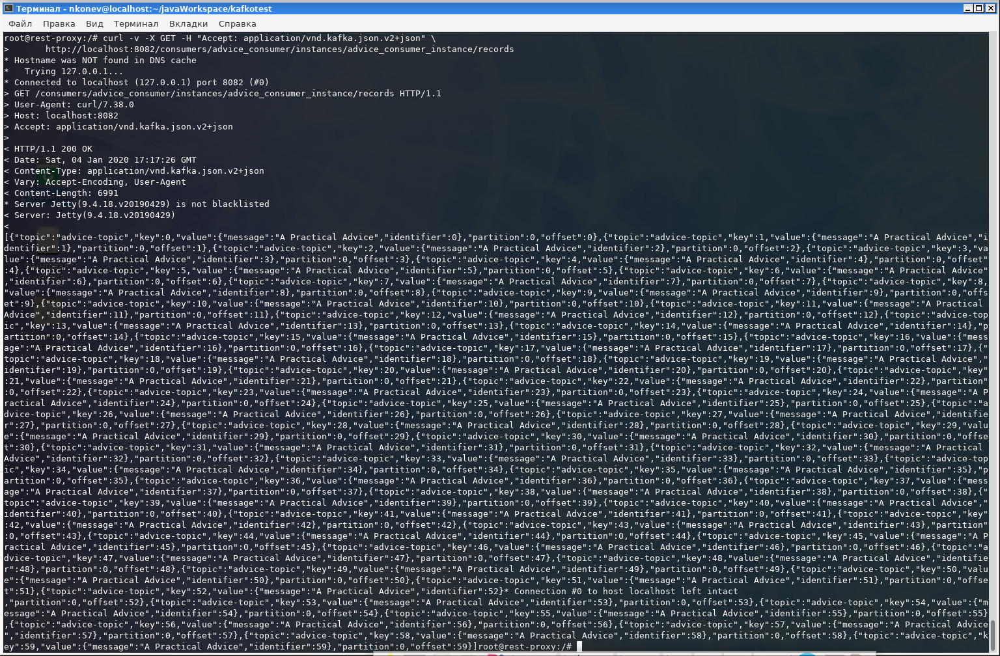

# Playing with kafka
```bash
docker-compose logs broker | grep retention

docker-compose up -d
docker-compose exec broker bash

kafka-console-consumer --bootstrap-server=broker:29092   --topic advice-topic --offset=earliest --partition=0
kafka-topics --zookeeper zookeeper:2181 --delete --topic advice-topic
kafka-topics  --bootstrap-server=broker:29092  --list
kafka-topics --bootstrap-server=broker:29092  --describe --topic advice-topic

# Get retention
## possible see overrides https://stackoverflow.com/a/42399549/4655234
kafka-topics --bootstrap-server=broker:29092 --describe --topics-with-overrides
kafka-configs --zookeeper zookeeper:2181  --describe --entity-type topics
kafka-configs --zookeeper zookeeper:2181  --describe --entity-type brokers

kafka-console-consumer --bootstrap-server broker:29092 --topic advice-topic --max-messages 2 --offset 0 --partition 0
# step by two message with commit offset
kafka-console-consumer --bootstrap-server broker:9092 --topic advice-topic --max-messages 2 --from-beginning --consumer-property group.id=ololoNikita

exit

# https://docs.confluent.io/current/kafka-rest/quickstart.html
# https://docs.confluent.io/current/kafka-rest/api.html
docker-compose exec rest-proxy bash

curl -v -X POST -H "Content-Type: application/vnd.kafka.v2+json" \
      --data '{"name": "advice_consumer_instance", "format": "json", "auto.offset.reset": "earliest"}' \
      http://localhost:8082/consumers/advice_consumer

curl -v -X POST -H "Content-Type: application/vnd.kafka.v2+json" --data '{"topics":["advice-topic"]}' \
 http://localhost:8082/consumers/advice_consumer/instances/advice_consumer_instance/subscription

curl -v -X GET -H "Accept: application/vnd.kafka.json.v2+json" \
      http://localhost:8082/consumers/advice_consumer/instances/advice_consumer_instance/records

# get message without subscription
# https://docs.confluent.io/current/kafka-rest/api.html#get--topics-(string-topic_name)-partitions-(int-partition_id)-messages?offset=(int)[&count=(int)]
# for this works you should set KAFKA_REST_ZOOKEEPER_CONNECT: 'zookeeper:2181' in docker-compose
curl -v -H "Accept: application/vnd.kafka.json.v1+json" 'http://localhost:8082/topics/advice-topic/partitions/0/messages?offset=0'
```


# Transactions

## Useful links
* https://www.cloudkarafka.com/blog/2019-04-10-apache-kafka-idempotent-producer-avoiding-message-duplication.html
* https://www.confluent.io/blog/spring-for-apache-kafka-deep-dive-part-1-error-handling-message-conversion-transaction-support/
* https://kafka.apache.org/documentation/#basic_ops_increase_replication_factor
* https://docs.spring.io/spring-kafka/reference/html/#transactions
* https://docs.spring.io/spring-boot/docs/current/reference/htmlsingle/#common-application-properties
* https://www.confluent.io/blog/transactions-apache-kafka/
* http://gharshangupta.blogspot.com/2015/03/spring-distributed-transactions-using_2.html
* https://www.javaworld.com/article/2077963/distributed-transactions-in-spring--with-and-without-xa.html

KafkaTransactionManager created in KafkaAutoConfiguration @ConditionalOnProperty(name = "spring.kafka.producer.transaction-id-prefix")

How to test:
1) Reset previously inserted and start containers
```
docker-compose down -v; docker-compose up -d
```

2) Pinpoint the time

# Setting up Transactions
## MongoDB
You need replica set and custom start command - see docker-compose.yml
`--replSet", "rs0`

## Kafka
You need configure producer and consumer in application.yml
### Consumer
```yaml
        isolation.level: read_committed # don't read still not committed messages
        max.poll.records: 8000 # Optimization
```

Also we add
```yaml
    listener:
      # increase batch consuming: set type=batch
      type: batch
      ack-mode: batch
      # increase batch consuming: set poll-timeout
      poll-timeout: 10s
```
for increase `@KafkaListener`'s speed.

### Producer
```yaml
    transaction-id-prefix: ${spring.cloud.client.ip-address}_tx. # prefix need for idempotency. it should be different across nodes. consider append http port if you run multiple web apps on same machine
        max.in.flight.requests.per.connection: 1 # for ordering
        enable.idempotence: true # make idempotent producer
        delivery.timeout.ms: 300000 # 5 minutes producer will re-send message(s?)
        retry.backoff.ms: 1000
        acks: all # we test acks of all 3 kafka replicas
```

### Spring
See `TransactionConfig.java`

# Open MongoDB
```
docker exec -it kafkotest_mongo_1 mongo
use test
db.practicalAdvice.count();
```

# Benchmark
We test adding 1 million dtos to Kafka, and write all to MongoDB.

## Spring Boot 2.2.4, no transactions, no batch Kafka, no MongoDB
```
2020-02-26 23:02:08.172  INFO 1525082 --- [ntainer#0-0-C-1] o.s.k.l.KafkaMessageListenerContainer    : group-id: partitions assigned: [advice-topic-0]
2020-02-26 23:02:18.470  INFO 1525082 --- [           main] c.e.kafkotest.KafkotestApplication       : All messages sent

2020-02-26 23:02:18.600  INFO 1525082 --- [ntainer#0-0-C-1] c.e.kafkotest.KafkotestApplication       : received:  Payload: PracticalAdvice{message='A Practical Advice Number 0', identifier=0, datetime=2020-02-26T23:02:04.113982}
2020-02-26 23:02:27.653  INFO 1525082 --- [ntainer#0-0-C-1] c.e.kafkotest.KafkotestApplication       : received:  Payload: PracticalAdvice{message='A Practical Advice Number 999999', identifier=999999, datetime=2020-02-26T23:02:18.470542}
```

## Spring Boot 2.2.4, no transactions, no batch Kafka, change int -> String in kafka message's key
```
2020-02-26 23:13:41.979  INFO 1574413 --- [ntainer#0-0-C-1] o.s.k.l.KafkaMessageListenerContainer    : group-id: partitions assigned: [advice-topic-0]
2020-02-26 23:14:00.798  INFO 1574413 --- [           main] c.e.kafkotest.KafkotestApplication       : All messages sent

2020-02-26 23:14:02.915  INFO 1574413 --- [ntainer#0-0-C-1] c.e.kafkotest.KafkotestApplication       : received:  Payload: PracticalAdvice{message='A Practical Advice Number 0', identifier=0, datetime=2020-02-26T23:13:37.628907}
2020-02-26 23:14:14.877  INFO 1574413 --- [ntainer#0-0-C-1] c.e.kafkotest.KafkotestApplication       : received:  Payload: PracticalAdvice{message='A Practical Advice Number 999999', identifier=999999, datetime=2020-02-26T23:14:00.798071}
```

## Spring Boot 2.2.4, Kafka + MongoDB transactions, batch Kafka, bulk MongoDB
```
2020-02-27 01:35:18.893  INFO 2184648 --- [ntainer#0-0-C-1] o.s.k.l.KafkaMessageListenerContainer    : group-id: partitions assigned: [advice-topic-0]
2020-02-27 01:35:43.849  INFO 2184648 --- [           main] c.e.kafkotest.KafkotestApplication       : All messages sent

2020-02-27 01:35:46.713  INFO 2184648 --- [ntainer#0-0-C-1] c.e.kafkotest.KafkotestApplication       : received:  Payload: PracticalAdvice{message='A Practical Advice Number 0', identifier=0, datetime=2020-02-27T01:35:16.115226}
2020-02-27 01:37:35.264  INFO 2184648 --- [ntainer#0-0-C-1] c.e.kafkotest.KafkotestApplication       : received:  Payload: PracticalAdvice{message='A Practical Advice Number 999999', identifier=999999, datetime=2020-02-27T01:35:43.849837}
```

## Spring Boot 2.2.4, Kafka + MongoDB transactions, batch Kafka, bulk MongoDB, MongoDB WriteConcern=JOURNALED on SSD
```
2020-02-27 03:11:41.887  INFO 43756 --- [ntainer#0-0-C-1] o.s.k.l.KafkaMessageListenerContainer    : my-advice-app: partitions assigned: [advice-topic-0]
2020-02-27 03:11:58.974  INFO 43756 --- [           main] c.e.kafkotest.KafkotestApplication       : All messages sent

2020-02-27 03:12:00.323  INFO 43756 --- [ntainer#0-0-C-1] c.e.kafkotest.KafkotestApplication       : received:  Payload: PracticalAdvice{message='A Practical Advice Number 0', identifier=0, datetime=2020-02-27T03:11:37.946041}
2020-02-27 03:13:43.909  INFO 43756 --- [ntainer#0-0-C-1] c.e.kafkotest.KafkotestApplication       : received:  Payload: PracticalAdvice{message='A Practical Advice Number 999999', identifier=999999, datetime=2020-02-27T03:11:58.974225}
```

## Spring Boot 2.2.4, Kafka + MongoDB no transactions, batch Kafka, bulk MongoDB
```
# another PC
2020-02-27 19:35:03.464  INFO 2303549 --- [ntainer#0-0-C-1] o.s.k.l.KafkaMessageListenerContainer    : my-advice-app: partitions assigned: [advice-topic-0]
2020-02-27 19:35:03.885  INFO 2303549 --- [ntainer#0-0-C-1] c.e.kafkotest.KafkotestApplication       : received:  Payload: PracticalAdvice{message='A Practical Advice Number 0', identifier=0, datetime=2020-02-27T19:34:58.034558}

2020-02-27 19:35:17.891  INFO 2303549 --- [           main] c.e.kafkotest.KafkotestApplication       : All messages sent
2020-02-27 19:36:40.190  INFO 2303549 --- [ntainer#0-0-C-1] c.e.kafkotest.KafkotestApplication       : received:  Payload: PracticalAdvice{message='A Practical Advice Number 999999', identifier=999999, datetime=2020-02-27T19:35:17.891611}
```


If you let MongoDB generate ids, e. g. modify `PracticalAdvice.java` and its will null then
```java
    @Id
    private String id;
```
MongoDB will inserts faster:
## Spring Boot 2.2.4, Kafka + MongoDB transactions, batch Kafka, bulk MongoDB, MongoDB WriteConcern=JOURNALED on SSD, ids=null
```
2020-02-27 21:37:45.189  INFO 2424167 --- [ntainer#0-0-C-1] o.s.k.l.KafkaMessageListenerContainer    : my-advice-app: partitions assigned: [advice-topic-0]
2020-02-27 21:38:05.340  INFO 2424167 --- [           main] c.e.kafkotest.KafkotestApplication       : All messages sent
2020-02-27 21:38:07.374  INFO 2424167 --- [ntainer#0-0-C-1] c.e.kafkotest.KafkotestApplication       : received:  Payload: PracticalAdvice{message='A Practical Advice Number 0', identifier=0, datetime=2020-02-27T21:37:41.466963}
2020-02-27 21:38:42.918  INFO 2424167 --- [ntainer#0-0-C-1] c.e.kafkotest.KafkotestApplication       : received:  Payload: PracticalAdvice{message='A Practical Advice Number 999999', identifier=999999, datetime=2020-02-27T21:38:05.340141}
```

# TODO
* Add restart unless-stopped to docker-compose
* Set volumes to Kafka and Zookeeper to be able to survive computer restart
