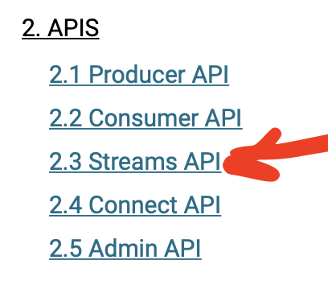

# Presentation plan
0. Kafka is consists of several apis (Producer-Consumer, Stream, Connect, ...) [](https://kafka.apache.org/documentation/)


KSQLDB uses [Stream API](https://docs.confluent.io/5.0.4/streams/faq.html).

1. There are [3 kind of queries](https://docs.ksqldb.io/en/latest/concepts/queries/): persistent, push, and pull. Persistent queries are server-side queries that run indefinitely processing rows of events. You issue persistent queries by deriving new streams and new tables from existing streams or tables. (CREATE STREAM AS SELECT, CREATE TABLE AS SELECT) https://docs.ksqldb.io/en/latest/concepts/queries/
2. What is stream. A stream is a partitioned, immutable, append-only collection that represents a series of historical facts. For example, the rows of a stream could model a sequence of financial transactions, like "Alice sent $100 to Bob", followed by "Charlie sent $50 to Bob".
3. What is table. A table is a mutable, partitioned collection that models change over time. In contrast with a stream, which represents a historical sequence of events, a table represents what is true as of "now". For example, you might use a table to model the locations where someone has lived as a stream: first Miami, then New York, then London, and so forth.
4. [Pull select](https://docs.ksqldb.io/en/latest/developer-guide/ksqldb-reference/select-pull-query/) (from table, for request/response) - a client pulls a table. Pulls the current value from the materialized view and terminates. The result of this statement is not persisted in a Kafka topic. By default, only key is supported in `WHERE` clause https://docs.ksqldb.io/en/latest/developer-guide/ksqldb-reference/select-pull-query/#where-clause-guidelines.
5. [Push select](https://docs.ksqldb.io/en/latest/developer-guide/ksqldb-reference/select-push-query/) (from stream, for subscription on changes) - a stream pushes to client. The result of this statement isn't persisted in a Kafka topic. Unlike persistent queries, push queries are not shared. If multiple clients submit the same push query, ksqlDB computes independent results for each client.
6. [Window types](https://docs.ksqldb.io/en/latest/concepts/time-and-windows-in-ksqldb-queries/#window-types)
   When using windows in your SQL queries, aggregate functions are applied only to the records that occur within a specific time window. Records that arrive out-of-order are handled as you might expect: although the window end time has passed, the out-of-order records are still associated with the correct window.


7. Is offset possible in Kafka Stream / KSQL ? - No. If a node dies, all of those messages have to be replayed from the topic and inserted into the database. It’s only once all of these mutations are done that the processing can start again. https://www.jesse-anderson.com/2019/10/why-i-recommend-my-clients-not-use-ksql-and-kafka-streams/
  Because of this KSQL queries are not replacements for `@KafkaListener`
8. Because KSQL is designed for transform data (T in ETL) https://habr.com/en/company/neoflex/blog/593769/
9. Given this, if we need consumer group offset semantic for newly created stream (stopped cars) we need to sent its events to the new stream, then read them from it

# Migrations
```
make migrate-init
make migrate
```

# See advices (demo)
```
docker exec -it ksqldb ksql
CREATE STREAM advices_original (identifier varchar, message varchar, datetime varchar) WITH  (kafka_topic='advice-topic', value_format='JSON');
DESCRIBE EXTENDED advices_original;
SET 'auto.offset.reset'='earliest';
SELECT * FROM advices_original EMIT CHANGES;
...and wait > 30 seconds

SET 'auto.offset.reset'='earliest';
SELECT * FROM advices_original where identifier='900000' EMIT CHANGES;
...and wait > 30 seconds.
```

# Check topic is present after migration
```
docker exec -it kafka bash
kafka-topics --bootstrap-server localhost:9092 --list
```

# Deal with users
```
docker exec -it kafka bash
kafka-console-consumer --bootstrap-server localhost:9092 --from-beginning --property print.key=true --key-deserializer="org.apache.kafka.common.serialization.LongDeserializer" --topic users

in another terminal:
docker exec -it ksqldb ksql
INSERT INTO users (userid, registertime, gender, regionid) VALUES (123, 1510923225000, 'M', 'Moscow');
INSERT INTO users (userid, registertime, gender, regionid) VALUES (123, 1510923225000, 'MMM', 'Moscow');
INSERT INTO users (userid, registertime, gender, regionid) VALUES (234, 1510923999000, 'F', 'Yekaterinburg');

CREATE TABLE USERS_QUERYABLE_TMP AS SELECT * FROM USERS;
select * from USERS_QUERYABLE_TMP;
```

```
curl -Ss 'http://localhost:9088/user' | jq '.'
curl -Ss 'http://localhost:9088/user?userId=1,600' | jq '.'
curl -i -X PUT -H 'Content-Type: application/json' 'http://localhost:9088/user' -d '{"userId": 567, "registertime": null, "gender": "Male", "regionid": "Moscow"}'
curl -i -X DELETE 'http://localhost:9088/user/567'
```

```
select * from USERS_QUERYABLE;

INSERT INTO USERS_DELETED (USERID,DUMMY) VALUES (123,CAST(NULL AS VARCHAR));
```

# Deal with coordinates

Let's open console and start the query:
```
docker exec -it ksqldb ksql

SELECT 
    carid, cast(carid as string) as car, LATEST_BY_OFFSET(cast (latitude as double)) as latitude, LATEST_BY_OFFSET(cast(longitude as double)) as longitude
FROM coordinates_stream 
    WINDOW TUMBLING (SIZE 90 SECONDS, GRACE PERIOD 90 DAYS)
GROUP BY carid
HAVING 
    STDDEV_SAMP(CAST (latitude * 100000000000 AS bigint)) < 10 AND 
    STDDEV_SAMP(CAST (longitude * 100000000000 AS bigint)) < 10
EMIT CHANGES;
```

```
date -d '@1638797250000'
```

Let's POST first portion of coordinates
```
curl -i 'http://localhost:8099/upload' -F file=@./producer-service/coordinates1.csv
docker exec -it kafka bash
kafka-console-consumer --bootstrap-server localhost:9092 --from-beginning --property print.key=true --property print.timestamp=true --key-deserializer="org.apache.kafka.common.serialization.StringDeserializer" --topic coordinates
```


We see car 1 stops.
Now let's issue the second query
```
curl -i 'http://localhost:8099/upload' -F file=@./producer-service/coordinates2.csv
```

We see second car stop

Programmatically, we can read from topic with any consumer:
```
kafka-console-consumer --bootstrap-server localhost:9092 --from-beginning --property print.key=true --property print.timestamp=true --topic stopped_cars
```
